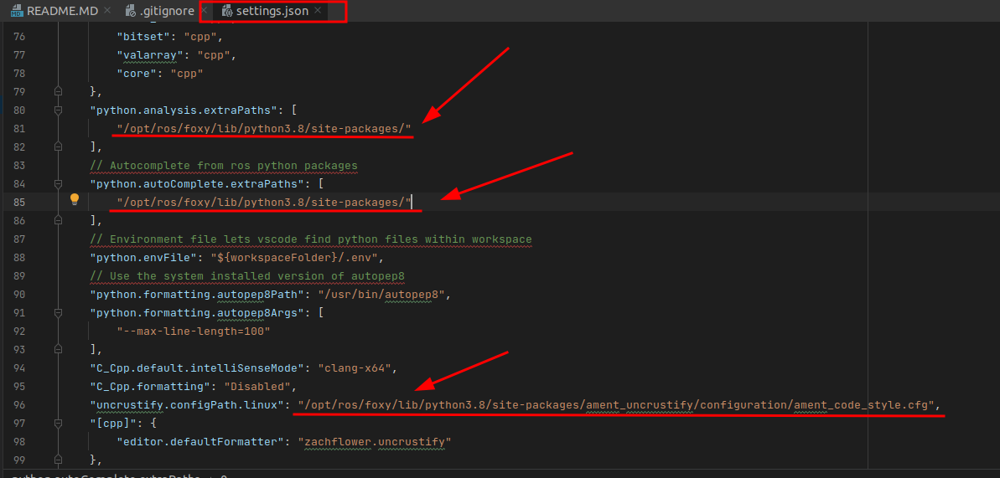

# ROS2 project pattern

## Environment setup

### Prepare

[ROS2 installation](https://docs.ros.org/en/rolling/Installation.html)

### Vscode

[vscode template](https://github.com/athackst/vscode_ros2_workspace)

You can use **.vscode_config** folder for setup ros2 debug
Change your path before usage.

Rename **.vscode_config** to **.vscode**

### Clion

Setup guide for clion [see here](https://www.jetbrains.com/help/clion/ros2-tutorial.html#create-workspace)

This guide is for Windows system, but it works for ubuntu OS too.

